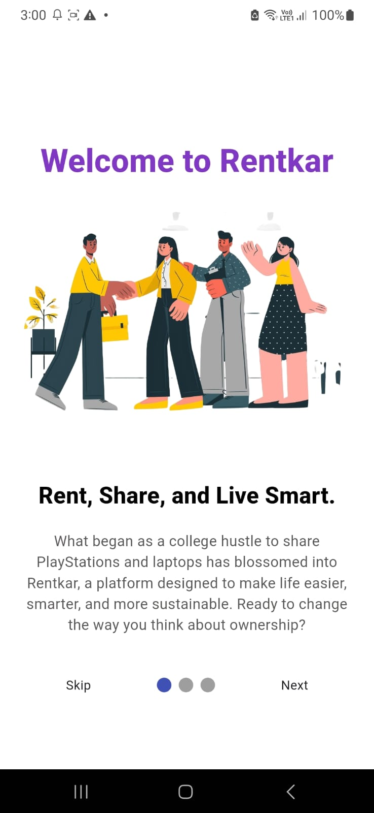
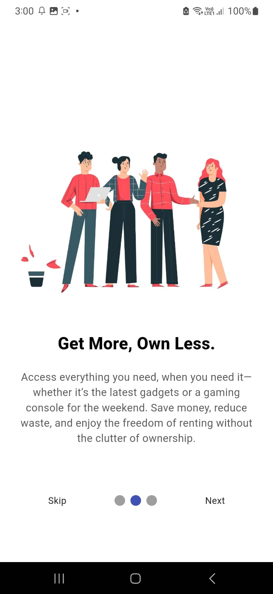
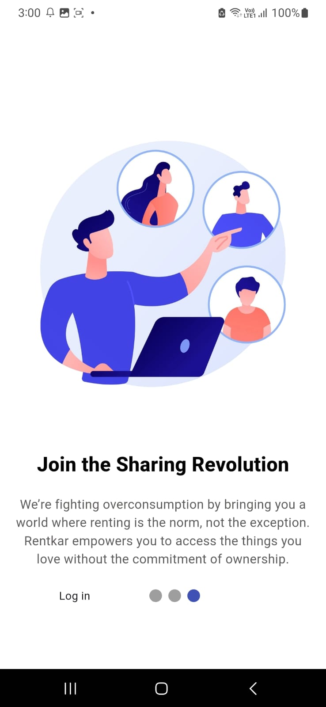
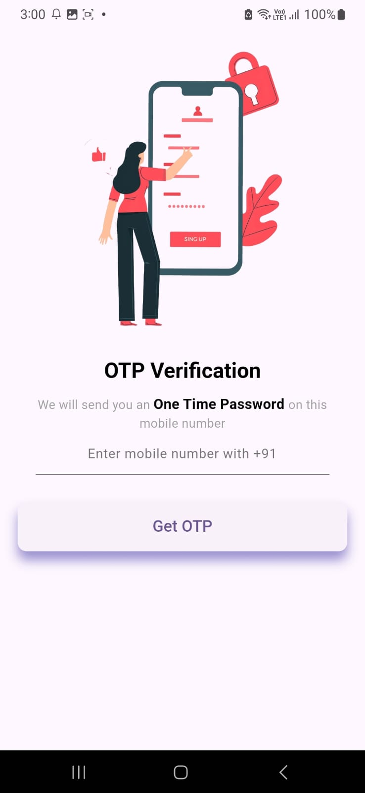
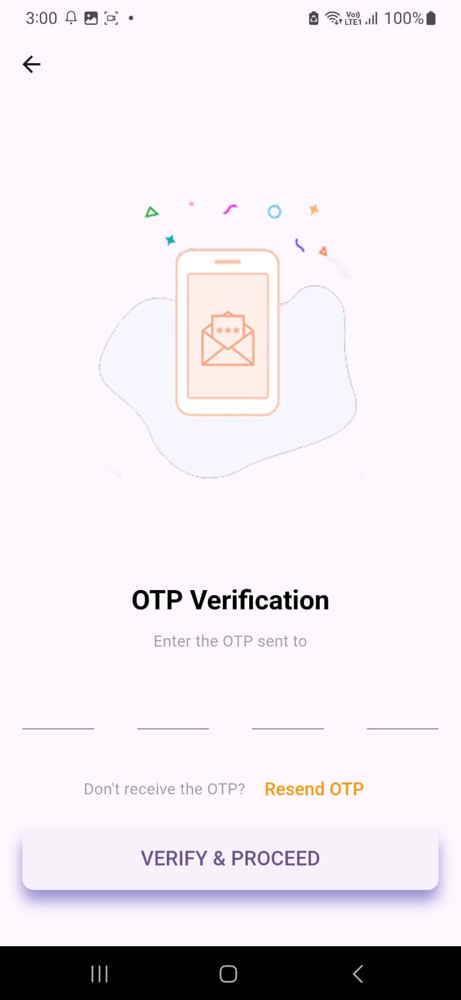

# Rentkar App - Internship Assignment

## Overview
This project was developed as part of my Flutter internship assignment. It includes:
- Three visually appealing onboarding screens.
- Integration of real mobile number login with OTP functionality using Firebase.

## Features
- **Onboarding Screens**: 
  - Introduces users to Rentkar’s platform with smooth transitions.
  - Features: App Introduction, Key Features, and Mission & Vision.
  
- **OTP-based Mobile Number Login**: 
  - Users can log in using their mobile number and OTP sent via Firebase.

## Technologies Used
- **Flutter**: For building the app UI and logic.
- **Firebase Authentication**: For OTP-based login functionality.
- **PageView**: For creating the onboarding screens.

## Screenshots
Here are some screenshots of the app:

- **Onboarding Screen 1**  
  

- **Onboarding Screen 2**  
  

- **Onboarding Screen 3**  
  

- **Login with OTP Screen**  
  

- **OTP Verification Screen**  
  

## Setup Instructions

1. **Clone the repository:**
   ```bash
   git clone https://github.com/akshita1420/rentkar_app.git
